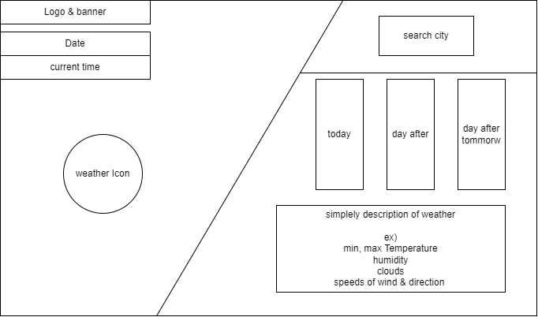
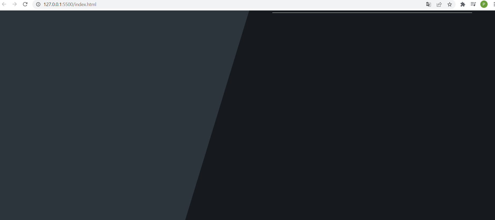
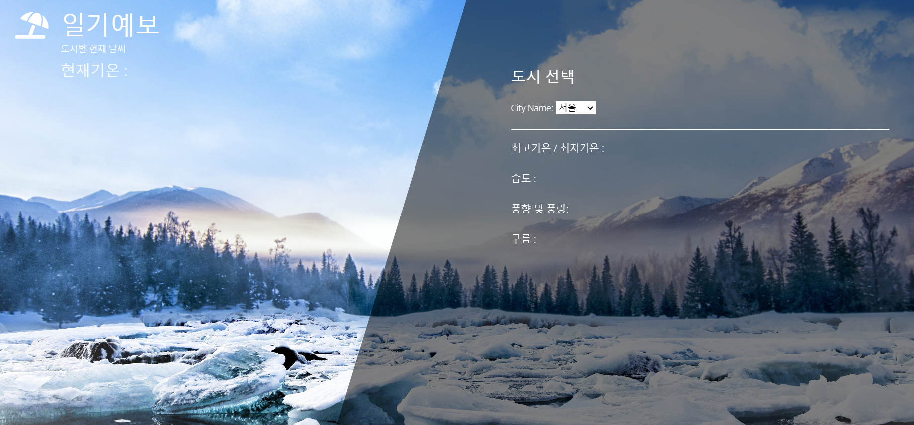
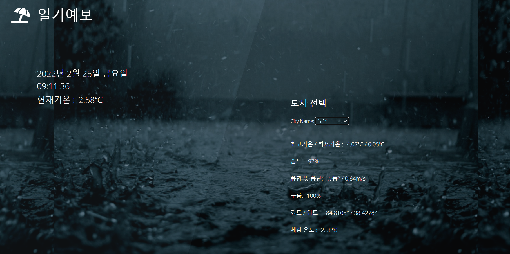
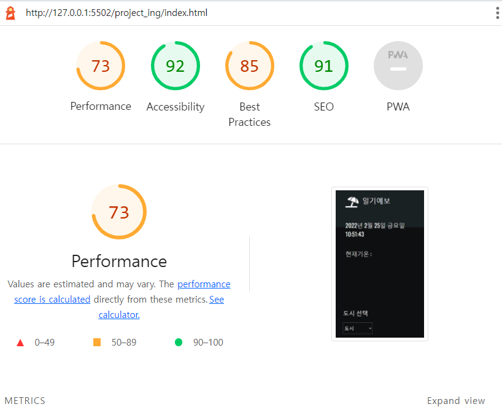
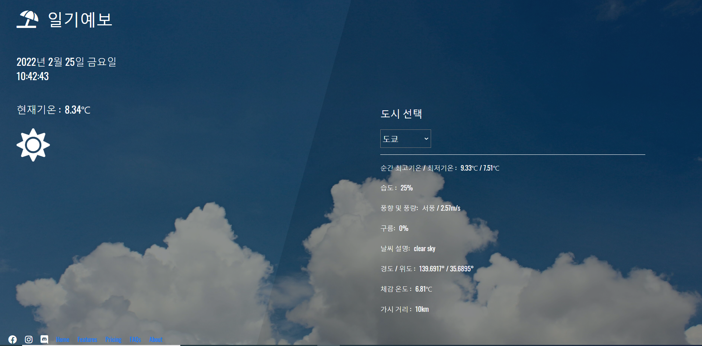

# HTML, CSS, JavaScript를 활용하여 도시별 현재 날씨를 보여주는 웹페이지 구현
  
## 👨‍👨‍👦‍👦 프로젝트 구성원 
  - [이승현](https://github.com/IlearnML)
  - [이정훈](https://github.com/nnn991)
  - [장우재](https://github.com/WoojaeJang)
  - 윤지원

## 📑 프로젝트 개요
- 프로젝트 목표 : 도시별 오늘의 날씨를 확인하는 일기예보 웹페이지 구현  
- 프로젝트 진행 기간 : 2022-02-24 ~ 2022-02-25  

## ⭐ 프로젝트 주요 기능 :  
- 기상정보 수집 : open API를 이용하여 도시별 날씨 정보를 받아왔다.   
  (openweathermap 사이트 이용 : [https://openweathermap.org])  
- 기상정보 분리 : json형태로 정보를 정리하고, 사용할 데이터를 분리한다.  
- 도시 설정 : 도시의 이름을 나타내는 value를 select - option을 활용하여 매칭시킨다.  
- 날짜 및 시간 : 현재 날짜 및 시간을 나타내는 section을 추가하였다.  
- 아이콘 : 날씨에 맞는 아이콘이 출력되도록 하였다.  
  

## 🏃 프로젝트 개발 과정 : 
  
1. 방향 설정 :   
구현기능 설계 및 아웃라인 도출  

2. 방향성 확인 :  

|  |
|---|

3. 브라우저 화면 구성 :  

|  |
|---|

4. 배경 및 브라우저 꾸미기 :  

||
|---|

5. 기능 점검 :  

||
|---|

 
6. Lighthouse :

||
|---|

(Lighthouse는 단순히 참고용으로 사용하였다.)
  

## 🍎 프로젝트 최종 결과

||
|---| 

- 버튼으로 도시를 선택하면 해당 도시의 날씨 정보가 표시된다.
- 해당 날씨 정보에 따른 날씨 이모지가 표시된다.
- 해당 날씨에 맞는 배경이미지가 적용된다.
- 현재 시간이 초단위로 실시간 표시된다. 

## 🔨 Error revising  
- 도시 이름 정보를 받아오기 : 이름의 정보를 받아오는 것이 아니라 index를 받아오는 것임을 늦게 알아차렸다.  
  
- openweathermap은 온도 정보를 절대온도(K)로 주기 때문에 섭씨로 바꾸는 작업이 필요했다.  
  - 그런데 알고보니 api url 뒤에 &units=metric을 붙이면 알아서 섭씨로 변경해 주었다.  
  
- 브라우저 화면에 나타나는 값을 변경하기 위해서 innerText를 사용하였는데 오류가 발생하였다.  
  - innerText는 안전성이 떨어지는 좋지 않은 방식이었다.  
  - textContent로 변경하니 바로 해결되었다.  

- 날씨에 따라서 배경화면이 변경되게 하는 부분에서 시간이 많이 소요되었다.  
  - 기존 설정에서는 img 태그를 사용,처음에 배경이 이미 존재하는 경우 classAdd를 활용한 배경 변경이 불가능했다.
  - div 태그로 변경한 후 배경 변경이 가능해졌다.  

## ❗ 느낀점
- Live share를 사용하여 작업 진행했으며 생각 이상으로 너무 편리했다.
- 다른사람이 작성한 CSS를 수정하는데 매우 힘들었다. 그 이유는 아직 CSS에 적응을 못했기 때문이다.
- 발표 이후에도 이미지가 화면 크기에 맞게 변하도록 연구하고 연구하여 최종적으로 알맞게 수정하여 뿌듯하였다.

## 😟 아쉬운 점
- 3일간의 날씨예측을 하고자 하였으나 해당 JSON 파일에서 value 값을 뽑아오는데에 시간이 부족하여 진행하지 못했다.
- 처음 웹 화면상 배경화면을 설정하지 못했다.
- 도시를 설정하면 해당 도시의 시간으로 변경하고자 하였으나 한국의 시간만 따올 수 있었다.
- 날씨에 대한 정보와 현재 온도 같은 경우 선택 후 화면 상에 드러나게 하고자 하였으나 그러지 못했다.
- 호스팅을 아직 공부하지 않아 호스팅을 하지 못해 매우 아쉬웠다.
